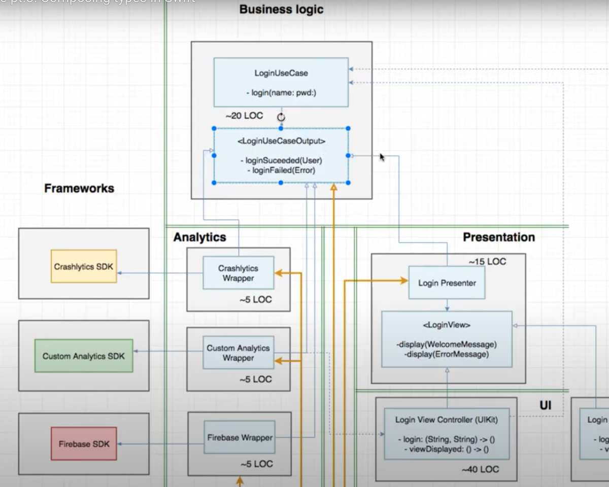
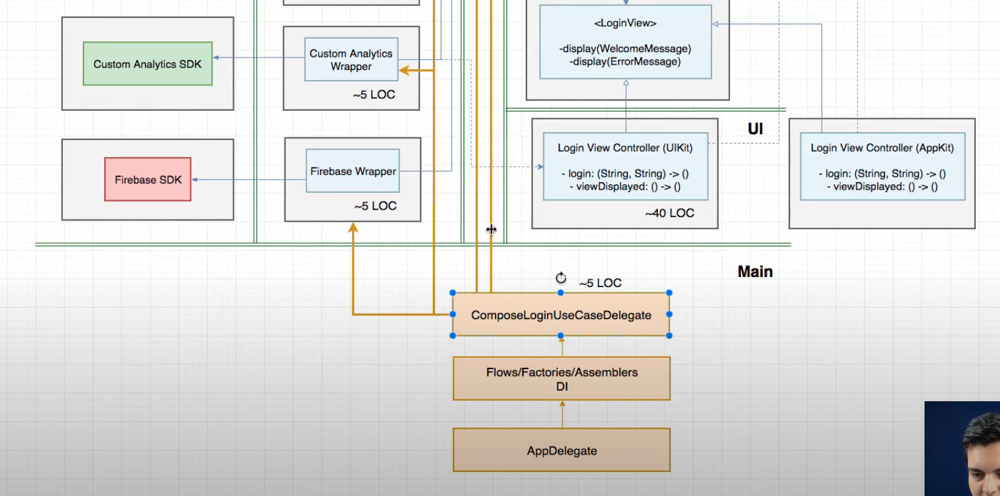
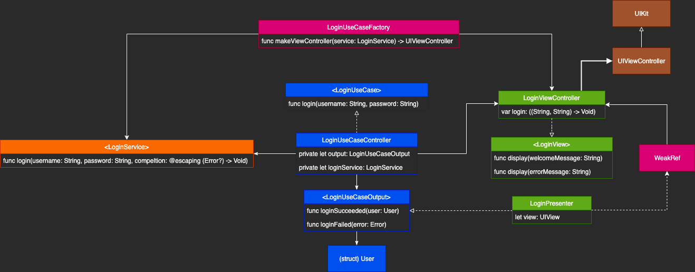

# Architecture planning

## What is Architecture?

MVC / MVP / MVVM / M**, are design patterns, not an app architecture.
Architecture is about structuring the intent of your system.

Architecture is the fundamental organization of a system embodied in its components, their relationships to each other, and to the environment, and the principles guiding its design and evolution. [IEEE 1471] [IBM](https://www.ibm.com/developerworks/rational/library/feb06/eeles/index.html#:~:text=The%20software%20architecture%20of%20a,and%20the%20relationships%20among%20them.)

Good software architecture makes your system soft (easy to change). [Fexible, maintanable, and scalable]

## iOS App Architecture sections

Business Logic, Frameworks, UI + Presentation, Main (Compose)
The business Logic is the highest level module, you don't want it depending on frameworks, or UI, or DBs or network.

On swift UIKit, the UIViewController implementation all ready have a lot of responsabilities, load view and the configuration of it.
So, thats the need of the presenter, in which implements the business logic protocols.

### Main Module
Where all your `Compose` happends, where Flows/Factories/Assemblers lives.

# Notes
- `LoginUseCase` is a concreete class with `login(user: String, password: String)` function.
- `LoginUseCaseOutput` is a protocol, that will be implemented for maybe analitics, a presenter, or any other implementation. The contract has two functions, `loginSuceeded()` and `loginFailed()`
- `LoginPresenter` implements the `LoginUseCaseOutput`, in this case, the presenter has the responsability of make a welcome | error view model to pas it to the view controller.
- The concreete implementation of analitics frameworks were... `CrashalyticsLoginTracker` that implements the `LoginUseCaseOutput` protocol too for analitics pourpose.
- The `LoginUseCase` makes a reference to an `output: LoginUseCaseOutput` value, an just delivers the message. 
- In `Main` or an `AppDelegate` we have  the concrete type `ComposeLoginUseCaseDelegate` concreete type, that is responsible for, compose all the objects, in this case.. `CrashaliticsWrapper` `FireBaseWrapper` and `LoginUseCasePresenter`
- Main is reponsible for factoring objects, or composing, setup the application.
- I dont need to know about composition, or concrete types, or instance them on business logic, presentation or UI.

## Implementation Diagram

An XCode iOS App Implementation

### Conclusions:

- `WeakRef` created to solve Presenter -> View strong reference, to prevent memory leaks on composition layer. 
