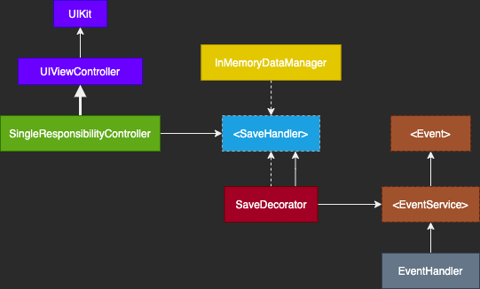

# Single Reponsibility Principle

With this feature I tried to have a concrete example and realice the importance of this priniciple.

## Feature requirements
- A screen with a single button that save some data in order to have this data available on the application life cycle, and can notify to ANY notification or events service this action when it success.

With this in mind, i've designed this diagram for all the entities involved.

As we can see, `SingleResponsabilityController` have the action to notify to the `<SaveHanlder>` reference, when the user tapped the save button, the controller doesn´t know what does the save handler entity do, giving the opportunity to meet what ever business requirements, in this case, save in memory any data and notify to event services.

To respect the Single Responsibility Principle, I´ve separated the event notification feature and the save in memory feature in to three simple classes, `InMemoryDataManager` which handles all inMemory data, the event notification with the `EventHandler` implementation, and the `SaveDecorator` class to integrate both services with the business rule with complete decopuling.
