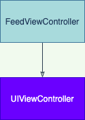

# Code basic diagrams, UML

Communication tool for ourselves and other developers in the team, and documentation, and makes easy to see dependency between modules and visual identification of potential memory leaks.

## CodeDiagrams project

Single class was created on this proyect called `FeedViewController`. This is represented like this:

This class is destinated to make a screen representation for iOS platform, so, we added the inheritance from `UIViewController`:

The dependency of an interface (`protocol` in swift) like FeedLoadable on this example, should be like this.

A `FeedLoadable` implementation were added, as `RemoteFeedLoader` to fetch data. (i.e. Url session to make a HTTP request). In this example, `RemoteFeedLoader` conforms to `FeedLoadable` protocol.

`LocalFeedLoader` implementation added, to conform `FeedLoadable`, thats the advantage of usign protocol, so the view controller, does not have to know where the data is from.

